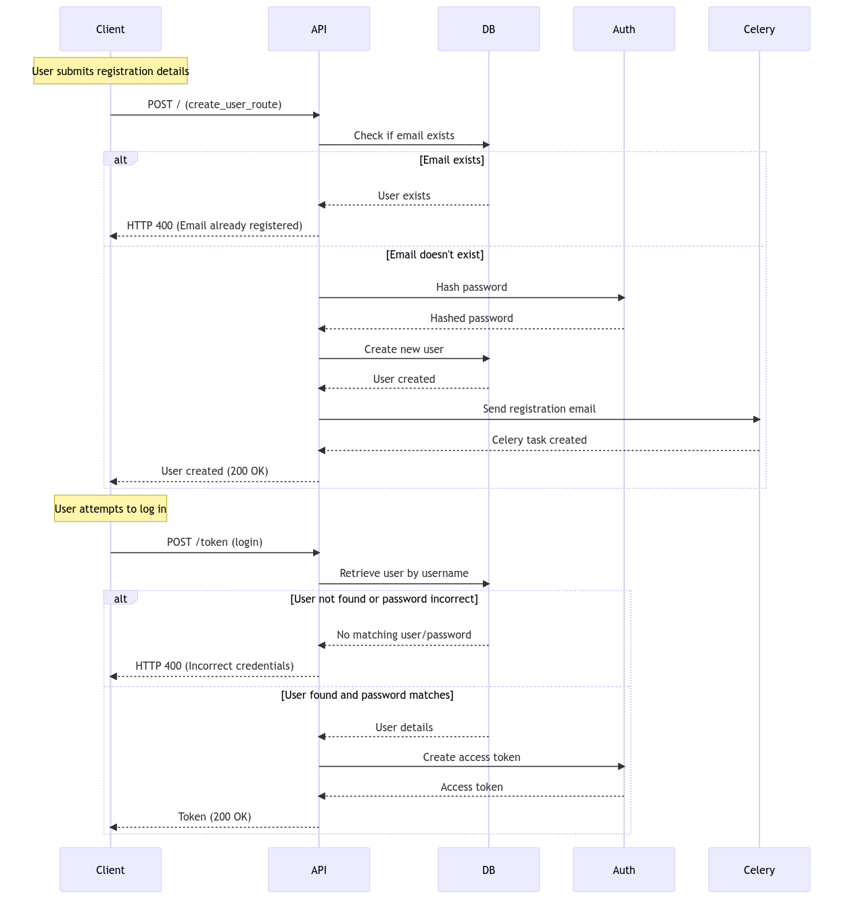
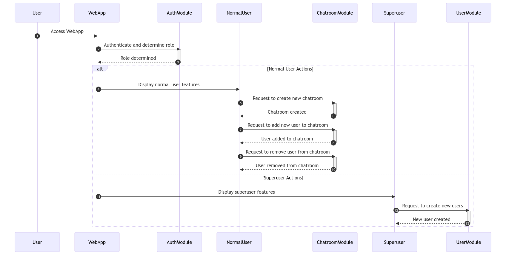

# Lab 3: Advanced User Management and Chatroom Module

Lab 3 builds upon the work of Lab 2 by introducing advanced user roles and a brand-new chatroom module, enhancing the project's features and security.

## Table of Contents
1. [User Roles](#user-roles)
2. [Chatroom Module](#chatroom-module)
3. [Project Structure](#project-structure)
4. [Diagram Flow](#diagram-flow)
5. [Usage](#usage)
6. [Future Improvements](#future-improvements)

## User Roles

In Lab 3, we have two user roles:
1. **Superuser**: Has elevated privileges and can perform actions like adding new users.
2. **Normal User**: Standard users who can use regular features.

**New Decorators for Route Protection**:
- `login_required`: Ensures the user is logged in.
- `superuser_required`: Ensures the user is a superuser.

## Chatroom Module

We introduce a chatroom module where users can:
- Create new chatrooms.
- Add users to chatrooms they own.
- View chatrooms they are a part of.

### Chatroom Features:

- **CRUD Operations**: Users can create, read, update, and delete chatrooms.
- **Member Management**: Superusers can add or remove members from chatrooms.

## Project Structure

The project structure has been updated to reflect the new modules and changes:
```
.
./main.py
./alembic
./project/chatrooms
./project/users
... (other files and directories)
```
## Diagram Flow

### User Module


### Chatroom Module


## Usage

1. **Creating a Chatroom**: `POST` request to `/create/` with chatroom details.
2. **Viewing Chatrooms**: `GET` request to `/` to view chatrooms for the logged-in user.
3. **Adding a User to Chatroom**: `POST` request to `/chatrooms/{chatroom_id}/add_user` with the username to add.

Note: Make sure you have the correct user role for specific actions.

## Future Improvements

- Implement chat functionality within chatrooms.
- Add more user roles and refine access controls.
- Enhance the chatroom interface and provide notifications for chatroom activity.
