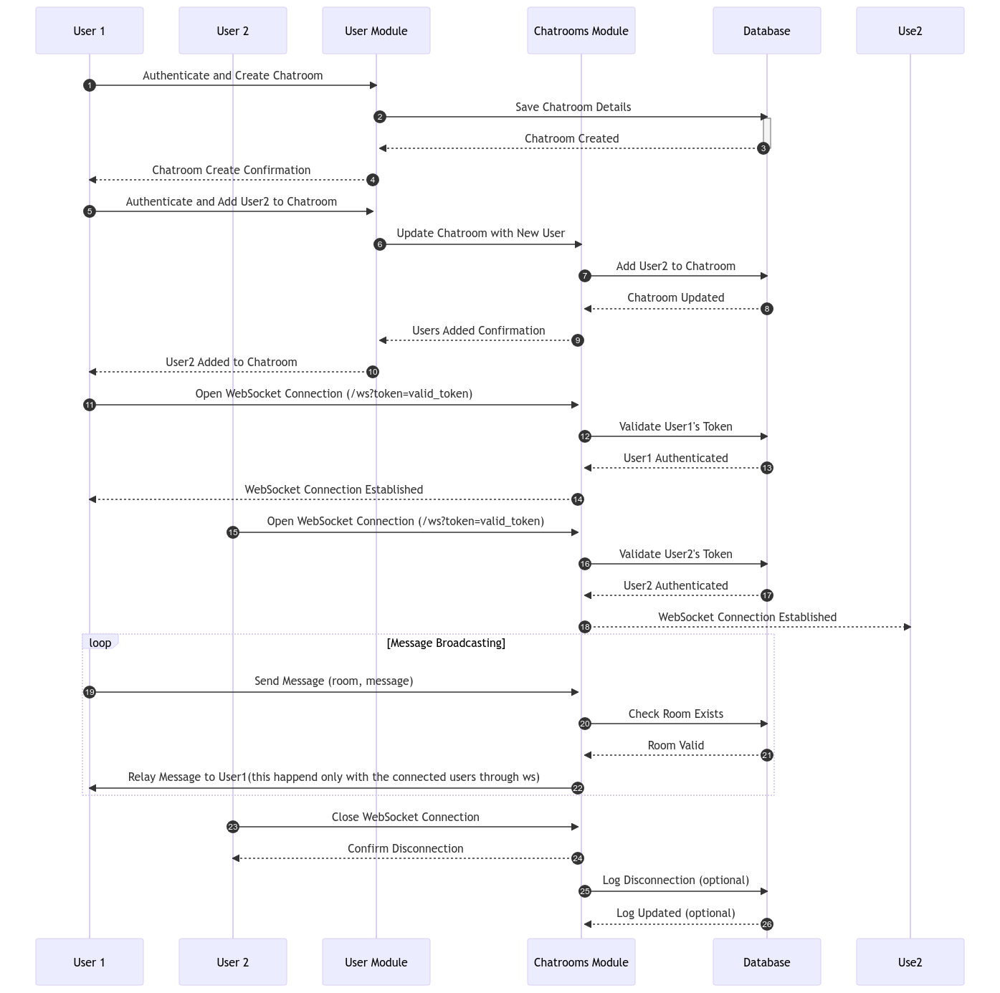

# Lab 4: Real-Time Chat Application

Lab 4 enhances the previous chatroom application by introducing real-time messaging capabilities, allowing users to send and receive messages instantaneously. This README provides all the necessary information to get started with the application, its usage, and the technical details.

## Table of Contents
- [Designs](#designs)
- [Usage](#usage)
- [API Endpoints](#api-endpoints)

## Designs

## Usage

Once the application is running, you can interact with the chatroom functionalities. Use the following steps to get started:

1. **Create a Chatroom**: Send a `POST` request to `/create/` with chatroom details.
2. **View Chatrooms**: Send a `GET` request to `/` to view chatrooms for the logged-in user.
3. **Add User to Chatroom**: Send a `POST` request to `/chatrooms/{chatroom_id}/add_user` with the username to add.
4. **Send a Message**: Connect to the WebSocket endpoint and send a message payload.

For detailed API usage and WebSocket interaction, refer to the [API Endpoints](#api-endpoints) section.

## New API Endpoints

List your API endpoints here, for example:

- `POST /create/` - Create a new chatroom.(lab 3)
- `GET /` - Retrieve the list of chatrooms.(lab 3)
- `POST /chatrooms/{chatroom_id}/add_user` - Add a user to a specific chatroom.(lab 3)
- WebSocket `chatroom/ws/` - WebSocket endpoint for real-time messaging.(new)
