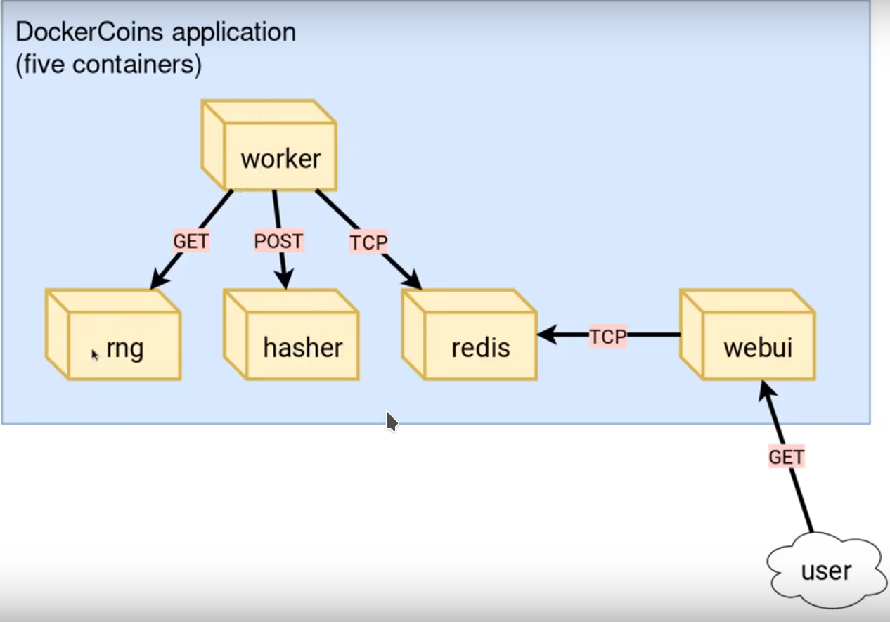
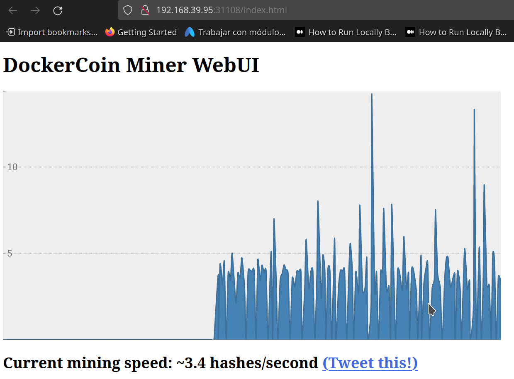

# Docker Coins en Kubernetes
En este laboratorio montara la conocida  aplicacion [`Docker Coins`](https://github.com/dockersamples/dockercoins){target=_blank} en Kubernetes, especificamente se clono este repositorio [`Docker Coins`](https://github.com/platzi/curso-kubernetes/){target=_blank}



Cada microservicio(`worker`,`rng`,`webui`,`hasher`) y redis se montara en `Pods` diferentes.
1. Clonar el repo:
```sh
git clone https://github.com/platzi/curso-kubernetes
# dockercoins projects is in dockercoins folder
```
2. Como se ve en el diagrama de arquitectura,  `worker` y  `webui` son los unicos microservicios que acceden a otros, se deben modificar las urls de acceso a los otros microservicios, para colocar las urls `svc` de kubernetes, ya que se usaran servicios `NodePort` para poder acceder a los microservicios, con los nombres: `redis`,`rng`,`hasher` respectivamente.

```diff
### dockercoins/webui/webui.js line 5
- var client = redis.createClient(6379, 'redis');
+ var client = redis.createClient(6379, 'redis.default.svc.cluster.local');
```
```diff
### dockercoins/worker/worker.py line 17
- redis = Redis("redis")
+ redis = Redis("redis.default.svc.cluster.local")
```
```diff
### dockercoins/worker/worker.py line 21
- r = requests.get("http://rng/32")
+ r = requests.get("http://rng.default.svc.cluster.local/32")
```
```diff
### dockercoins/worker/worker.py line 26,27,28
- r = requests.post("http://hasher/",
-                      data=data,
-                      headers={"Content-Type": "application/octet-stream"})
+ r = requests.post("http://hasher.default.svc.cluster.local/",
+                      data=data,
+                      headers={"Content-Type": "application/octet-stream"})
```

Notar que:

  -  En nodejs hay que poner la url sin `http://`.
  -  En python si hay que colocarlo en las urls que se consumen con la libreria `requests`.
  -  La url de  `redis` no lleva el protocolo:  `redis.default.svc.cluster.local`.<br/><br/>
<br/>
<div></div>


3. Crear las imagenes de docker, por facilidad se usara docker-compose para generar todas las imagenes con un comando. Antes apuntar al registry de `minikube`
```sh
$ eval $(minikube -p minikube docker-env)

```
```sh
## TODO ignore redis build
$ docker-compose  -f dockercoins/docker-compose.yml  build
```
4. Renombrar las imagenes

```sh
docker tag dockercoins_worker  santos/docker-coins-worker-app
docker tag dockercoins_hasher santos/docker-coins-hasher-app
docker tag dockercoins_rng:latest   santos/docker-coins-rng-app
docker tag dockercoins_webui santos/docker-coins-web-ui-app
```
5. Crear los archivos de depliegue de `kubernetes`
```yaml title="config.yaml"
apiVersion: v1
kind: ConfigMap
metadata:
  name: redis-configmap
  namespace: default
data:
  redis.conf: |
    protected-mode no
    maxmemory 32mb
    maxmemory-policy allkeys-lru
# cat /usr/local/etc/redis/redis.conf 

---

apiVersion: v1
kind: ConfigMap
metadata:
  name: redis-sysctl
  namespace: default
data:
  sysctl.conf: |
    net.core.somaxconn=511
    vm.overcommit_memory=1
    net.core.somaxconn=4096

```
```yaml title="deployment.yaml"

apiVersion: apps/v1
kind: Deployment
metadata:
  name: web-ui
  namespace: default
spec:
  selector:
    matchLabels:
      app: web-ui
      masterapp: dockercoins
  replicas: 1  # 
  template:
    metadata:
      labels:
        app: web-ui
        masterapp: dockercoins
    spec:
      containers:
      - name: web-ui
        image:  santos/docker-coins-web-ui-app
        imagePullPolicy: Never
        ports:
        - containerPort: 80
---
apiVersion: apps/v1
kind: Deployment
metadata:
  name: worker
  namespace: default
spec:
  selector:
    matchLabels:
      app: worker
      masterapp: dockercoins
  replicas: 1  # 
  template:
    metadata:
      labels:
        app: worker
        masterapp: dockercoins
    spec:
      containers:
      - name: worker
        image:  santos/docker-coins-worker-app
        imagePullPolicy: Never
        # ports:
        # - containerPort: 80
---
apiVersion: apps/v1
kind: Deployment
metadata:
  name: redis
  namespace: default
spec:
  selector:
    matchLabels:
      app: redis
      masterapp: dockercoins
  replicas: 1  # 
  template:
    metadata:
      labels:
        app: redis
        masterapp: dockercoins
    spec:
      containers:
      - name: redis
        image:  redis
        imagePullPolicy: IfNotPresent
        ports:
        - containerPort: 6379
        volumeMounts:
        - mountPath: /usr/local/etc/redis/redis.conf
          name: redis-configmap
          subPath: redis.conf

        - mountPath: /etc/sysctl.conf
          name: redis-sysctl
          subPath: sysctl.conf
        command: ["redis-server", "/usr/local/etc/redis/redis.conf"]
      volumes:
      - name: redis-configmap
        configMap:
          name: redis-configmap
      - name: redis-sysctl
        configMap:
          name: redis-sysctl
---
apiVersion: apps/v1
kind: Deployment
metadata:
  name: hasher
  namespace: default
spec:
  selector:
    matchLabels:
      app: hasher
      masterapp: dockercoins
  replicas: 1  # 
  template:
    metadata:
      labels:
        app: hasher
        masterapp: dockercoins
    spec:
      containers:
      - name: hasher
        image:  santos/docker-coins-hasher-app
        imagePullPolicy: Never
        ports:
        - containerPort: 80
---
apiVersion: apps/v1
kind: Deployment
metadata:
  name: rng
  namespace: default
spec:
  selector:
    matchLabels:
      app: rng
      masterapp: dockercoins
  replicas: 1  # 
  template:
    metadata:
      labels:
        app: rng
        masterapp: dockercoins
    spec:
      containers:
      - name: rng
        image:  santos/docker-coins-rng-app
        imagePullPolicy: Never
        ports:
        - containerPort: 80
```
```yaml title="services.yaml"
#save as ./services.yaml


apiVersion: v1
kind: Service
metadata:

  name: web-ui
  namespace: default
spec:
  ports:
  - port: 80
    protocol: TCP
    targetPort: 80
  selector:
    app: web-ui
  type: NodePort
---
apiVersion: v1
kind: Service
metadata:

  name: redis
  namespace: default
spec:
  ports:
  - port: 6379
    # protocol: TCP
    targetPort: 6379
  selector:
    app: redis
  type: NodePort
---
apiVersion: v1
kind: Service
metadata:

  name: hasher
  namespace: default
spec:
  ports:
  - port: 80
    protocol: TCP
    targetPort: 80
  selector:
    app: hasher
  type: NodePort
---
apiVersion: v1
kind: Service
metadata:
  name:  rng
  namespace: default
spec:
  ports:
  - port: 80
    protocol: TCP
    targetPort: 80
  selector:
    app:  rng
  type: NodePort
```
Notar que en los deployments hay una etiqueta llamada `masterapp` con el valor dockercoins, la cual servira para hacer operaciones sobre todos los deployments. <br/>
6. Applicar los archivos de configuracion
```sh
$ kubectl apply -f config.yaml && kubectl apply -f services.yaml \
 && kubectl apply -f deployment.yaml
  # configmap/redis-configmap created
  # configmap/redis-sysctl created
  # service/web-ui created
  # service/redis created
  # service/hasher created
  # service/rng created
  # deployment.apps/web-ui created
  # deployment.apps/worker created
  # deployment.apps/redis created
  # deployment.apps/hasher created
  # deployment.apps/rng created
  # pod/dnsutils created
  # service/web-ui created
  # service/redis created
  # service/hasher created
  # service/rng created
```
7. Ver los pods
```sh
NAME                            READY   STATUS    RESTARTS      AGE
hasher-6fd7cfd7bf-8v86t         1/1     Running   0             7m51s
redis-594c4d767f-8xfrd          1/1     Running   0             7m51s
rng-648c7c46c7-qrn2m            1/1     Running   0             7m51s
web-ui-57b7674785-7cfj2         1/1     Running   0             7m51s
worker-67ff756f89-wvmt4         1/1     Running   0             7m51s
```
8. Ver los logs de todos los deployments

```bash
$ kubectl logs --selector masterapp=dockercoins
```
```sh
1:C 21 Jun 2022 20:47:44.841 # oO0OoO0OoO0Oo Redis is starting oO0OoO0OoO0Oo
1:C 21 Jun 2022 20:47:44.842 # Redis version=7.0.2, bits=64, commit=00000000, modified=0, pid=1, just started
1:C 21 Jun 2022 20:47:44.842 # Configuration loaded
1:M 21 Jun 2022 20:47:44.842 * monotonic clock: POSIX clock_gettime
1:M 21 Jun 2022 20:47:44.843 * Running mode=standalone, port=6379.
1:M 21 Jun 2022 20:47:44.843 # WARNING: The TCP backlog setting of 511 cannot be enforced because /proc/sys/net/core/somaxconn is set to the lower value of 128.
1:M 21 Jun 2022 20:47:44.843 # Server initialized
1:M 21 Jun 2022 20:47:44.843 # WARNING overcommit_memory is set to 0! Background save may fail under low memory condition. To fix this issue add 'vm.overcommit_memory = 1' to /etc/sysctl.conf and then reboot or run the command 'sysctl vm.overcommit_memory=1' for this to take effect.

INFO:__main__:4 units of work done, updating hash counter
INFO:__main__:4 units of work done, updating hash counter
INFO:__main__:4 units of work done, updating hash counter
INFO:__main__:4 units of work done, updating hash counter
INFO:__main__:Coin found: 0c7d1044...
INFO:__main__:4 units of work done, updating hash counter
INFO:__main__:Coin found: 0fe2be6c...
INFO:__main__:4 units of work done, updating hash counter
INFO:__main__:4 units of work done, updating hash counter
INFO:__main__:4 units of work done, updating hash counter

172.17.0.1 - - [21/Jun/2022:20:51:50 +0000] "POST / HTTP/1.1" 200 64 0.1007
172.17.0.1 - - [21/Jun/2022:20:51:50 +0000] "POST / HTTP/1.1" 200 64 0.1008
172.17.0.1 - - [21/Jun/2022:20:51:50 +0000] "POST / HTTP/1.1" 200 64 0.1006
172.17.0.1 - - [21/Jun/2022:20:51:50 +0000] "POST / HTTP/1.1" 200 64 0.1007
172.17.0.1 - - [21/Jun/2022:20:51:51 +0000] "POST / HTTP/1.1" 200 64 0.1007

172.17.0.1 - - [21/Jun/2022 20:52:03] "GET /32 HTTP/1.1" 200 -
172.17.0.1 - - [21/Jun/2022 20:52:03] "GET /32 HTTP/1.1" 200 -
172.17.0.1 - - [21/Jun/2022 20:52:03] "GET /32 HTTP/1.1" 200 -
172.17.0.1 - - [21/Jun/2022 20:52:04] "GET /32 HTTP/1.1" 200 -
172.17.0.1 - - [21/Jun/2022 20:52:04] "GET /32 HTTP/1.1" 200 -
172.17.0.1 - - [21/Jun/2022 20:52:04] "GET /32 HTTP/1.1" 200 -


WEBUI running on port 80
```
9. Exponer el servicio `NodePort` de `web-ui` con minikube 
```sh
$ minikube service web-ui --url
  # http://192.168.39.95:31108
```
10. Abrir el link en el navegador



## Posibles errores

1. Resolucion de `hostnames` `svc` en el microservicio `worker` o `webui`, puede ser porque se creo el servicio `NodePort` de los otros microservicios despues de que se ejecutaran los deplyments,  es decir no existian esos hostnames, para esto se puede reiniciar el deployment fallido.

```sh
$ kubectl rollout restart deployment worker
  # deployment.apps/worker restarted

$ kubectl rollout restart deployment web-ui
  # deployment.apps/web-ui restarted
```
2. `Connection refused` o `ENOTFOUND`, recordar que:

-  En nodejs hay que poner la url sin `http://`.
-  En python si hay que colocar el protocolo en  las urls que se consumen con la libreria `requests`.
-  La url de  `redis` no lleva el protocolo:  `redis.default.svc.cluster.local`.<br/><br/>
3. `ImageNeverPull`, no se apunto al registry de `minikube`:
```sh
$ eval $(minikube -p minikube docker-env)
```