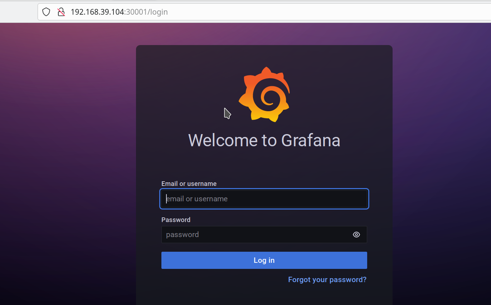

# Instalando graphana y prometheus en un  cluster


1. Buscar el paquete en artifacts hub: [kube-prometheus-stack](https://artifacthub.io/packages/helm/prometheus-community/kube-prometheus-stack){target=_blank}

2. Instalar el paquete:

```sh
$ helm repo add prom-repo https://prometheus-community.github.io/helm-charts
    #"prom-repo" has been added to your repositories
$ helm repo  update
    # Hang tight while we grab the latest from your chart repositories...
    # ...Successfully got an update from the "prom-repo" chart repository
    # ...Successfully got an update from the "prometheus-community" chart repository
    # ...Successfully got an update from the "bitnami" chart repository
    # ...Successfully got an update from the "strimzi" chart repository
    # Update Complete. ⎈Happy Helming!⎈
$  helm install my-kube-prometheus-stack prom-repo/kube-prometheus-stack
    # NAME: my-kube-prometheus-stack
    # LAST DEPLOYED: Tue Sep  6 12:43:31 2022
    # NAMESPACE: default
    # STATUS: deployed
    # REVISION: 1
    # NOTES:
    # kube-prometheus-stack has been installed. Check its status by running:
    #   kubectl --namespace default get pods -l "release=my-kube-prometheus-stack"

    # Visit https://github.com/prometheus-operator/kube-prometheus for instructions on how to create & configure Alertmanager and Prometheus instances using the Operator.

```

3. Ver todo lo que se instalo
```
$ kubectl get all
    NAME                                                               READY   STATUS    RESTARTS      AGE
    pod/alertmanager-my-kube-prometheus-stack-alertmanager-0           2/2     Running   0             75s
    pod/my-kube-prometheus-stack-grafana-f6f4b9bbf-4t6xx               3/3     Running   0             78s
    pod/my-kube-prometheus-stack-kube-state-metrics-7db8d845ff-fw6ww   1/1     Running   0             78s
    pod/my-kube-prometheus-stack-operator-5fc76fc95d-r8zgt             1/1     Running   0             78s
    pod/my-kube-prometheus-stack-prometheus-node-exporter-pdsgh        1/1     Running   0             78s
    pod/my-release-nginx-86445978c4-cqmgj                              1/1     Running   2 (38h ago)   5d19h
    pod/nginx                                                          1/1     Running   4 (38h ago)   92d
    pod/nginx-app-68cc968bbb-ljl99                                     1/1     Running   3 (38h ago)   6d20h
    pod/prometheus-my-kube-prometheus-stack-prometheus-0               2/2     Running   0             74s

    NAME                                                        TYPE           CLUSTER-IP       EXTERNAL-IP   PORT(S)                      AGE
    service/alertmanager-operated                               ClusterIP      None             <none>        9093/TCP,9094/TCP,9094/UDP   75s
    service/kubernetes                                          ClusterIP      10.96.0.1        <none>        443/TCP                      92d
    service/my-kube-prometheus-stack-alertmanager               ClusterIP      10.103.81.182    <none>        9093/TCP                     78s
    service/my-kube-prometheus-stack-grafana                    ClusterIP      10.109.202.64    <none>        80/TCP                       78s
    service/my-kube-prometheus-stack-kube-state-metrics         ClusterIP      10.103.232.64    <none>        8080/TCP                     78s
    service/my-kube-prometheus-stack-operator                   ClusterIP      10.104.93.232    <none>        443/TCP                      78s
    service/my-kube-prometheus-stack-prometheus                 ClusterIP      10.97.75.96      <none>        9090/TCP                     78s
    service/my-kube-prometheus-stack-prometheus-node-exporter   ClusterIP      10.97.206.26     <none>        9100/TCP                     78s
```

4. Para poder acceder al dashboard de grapaha se debe exponer el servicio `service/my-kube-prometheus-stack-grafana` en este caso con un `NodePort`, para eso hay que editar el servicio

```sh
$ kubectl edit  svc my-kube-prometheus-stack-grafana
```

Se deben hacer las siguientes modificaciones:
- Cambiar `spec.type` por `NodePort`
- Agregar `spec.ports.nodeport` con el valor 30001, este atributo no funciona con los servicios `ClusterIP`


```yaml title="Antes" 
apiVersion: v1
kind: Service
metadata:
  annotations:
    meta.helm.sh/release-name: my-kube-prometheus-stack
    meta.helm.sh/release-namespace: default
  creationTimestamp: "2022-09-06T17:43:39Z"
  labels:
    app.kubernetes.io/instance: my-kube-prometheus-stack
    app.kubernetes.io/managed-by: Helm
    app.kubernetes.io/name: grafana
    app.kubernetes.io/version: 9.0.5
    helm.sh/chart: grafana-6.32.10
  name: my-kube-prometheus-stack-grafana
  namespace: default
  resourceVersion: "1054945"
  uid: 6be59343-45db-4dc3-a5d0-7f1f890baf92
spec:
  clusterIP: 10.109.202.64
  clusterIPs:
  - 10.109.202.64
  externalTrafficPolicy: Cluster
  internalTrafficPolicy: Cluster
  ipFamilies:
  - IPv4
  ipFamilyPolicy: SingleStack
  ports:
  - name: http-web
    port: 80
    protocol: TCP
    targetPort: 3000
  type: ClusterIP 
  selector:
    app.kubernetes.io/instance: my-kube-prometheus-stack

```

```yaml title="Despues" 
apiVersion: v1
kind: Service
metadata:
  annotations:
    meta.helm.sh/release-name: my-kube-prometheus-stack
    meta.helm.sh/release-namespace: default
  creationTimestamp: "2022-09-06T17:43:39Z"
  labels:
    app.kubernetes.io/instance: my-kube-prometheus-stack
    app.kubernetes.io/managed-by: Helm
    app.kubernetes.io/name: grafana
    app.kubernetes.io/version: 9.0.5
    helm.sh/chart: grafana-6.32.10
  name: my-kube-prometheus-stack-grafana
  namespace: default
  resourceVersion: "1054945"
  uid: 6be59343-45db-4dc3-a5d0-7f1f890baf92
spec:
  clusterIP: 10.109.202.64
  clusterIPs:
  - 10.109.202.64
  externalTrafficPolicy: Cluster
  internalTrafficPolicy: Cluster
  ipFamilies:
  - IPv4
  ipFamilyPolicy: SingleStack
  ports:
  - name: http-web
    port: 80
    protocol: TCP
    targetPort: 3000 # (1)
    nodePort: 30001 # (2)
  type: NodePort 
  selector:
    app.kubernetes.io/instance: my-kube-prometheus-stack

```

5. obtener la ip de `minikube`

```sh
$ minikube ip
    # 192.168.39.104

```

6. abrir el navegador en la url `192.168.39.104:30001`


